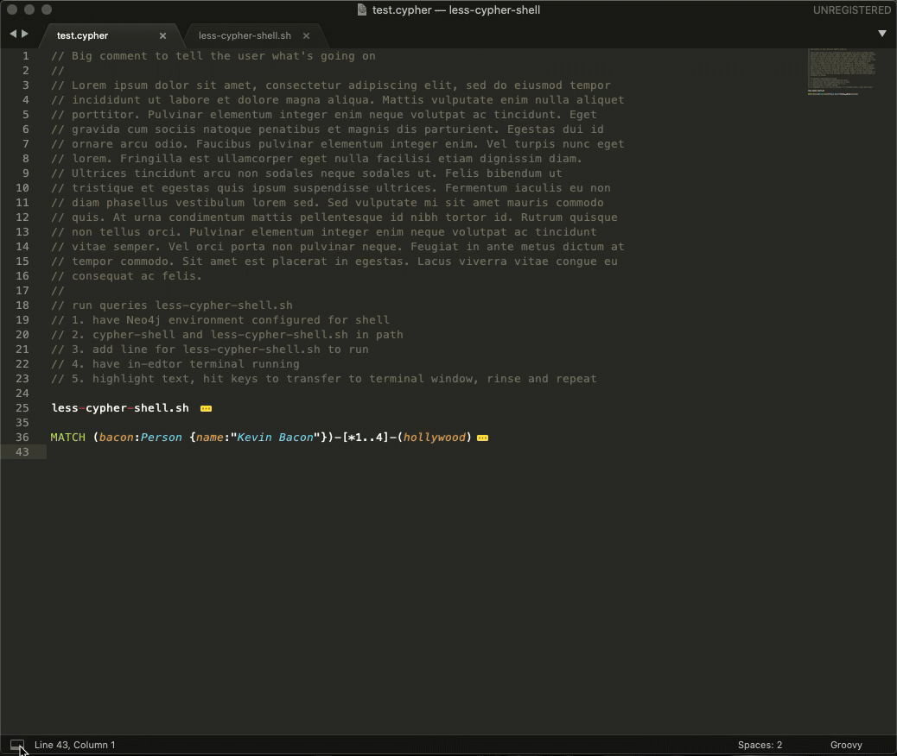
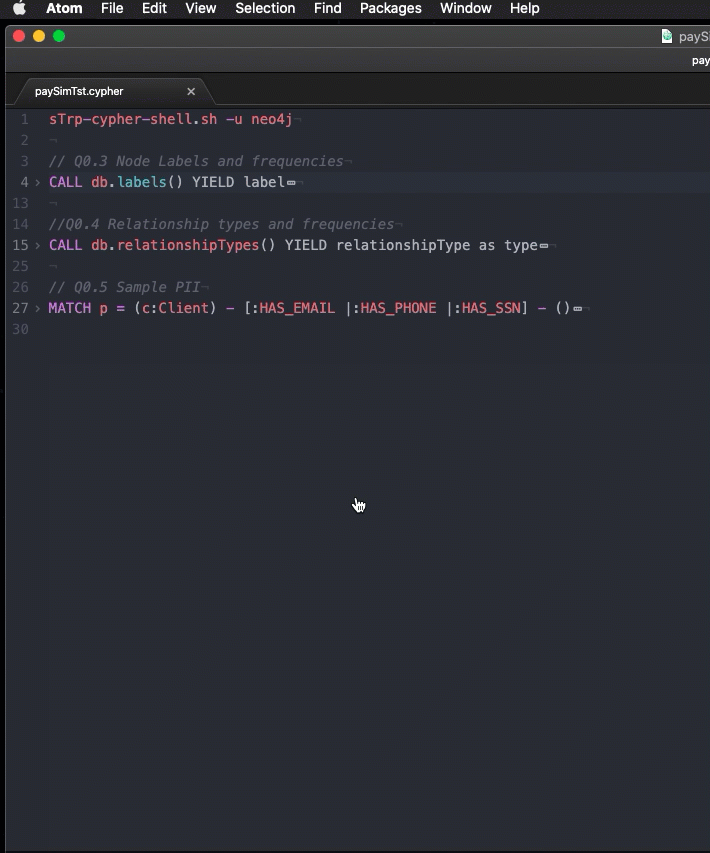

# Simple shell to run `cypher-shell` and send output to less
###  - From within an editor, such as _Sublime Text 3_, _Atom_, _VSCode_, _IntelliJ_ or any other editor that supports embedded terminals
###  - As a command line REPL interface to cypher-shell, including in a terminal shell started in Neo4j Desktop
# 
-----
<table>
    <tr>
        <th><b>Sublime Text 3</b></th>
    </tr>
    <tr>
        <td width="100%">
            <a href="images/sublime.gif">
                
            </a>
        </td>
    </tr>
    <tr>
        <th>Atom</th>
    </tr>
    <tr>
        <td width="100%">
            <a href=images/_Atom_.gif">
                
            </a>
        </td>
    </tr>
</table>


 ## _Why?_
 
## I wrote this for two reasons:

 1. I find it more efficient to write complex Cypher queries in an editor and wanted a mechanism to 
    just highlight my query and run it in an embedded terminal and then page through the output. 

 2. Often the query I write is fast, but it returns too much data for the Neo4j Browser to render in a 
    reasonable amount of time. The Neo4j Browser is an electron based browser app after all. There's always 
    Neo4j Bloom to visualize large sets of data, but that's not the target development environment here. 

 3. Most of the code for `repl-cypher-shell.sh` was already built for another database command line tool a 
    long, long, long... ago. I think you can tell from the style.  Should redo in python.  OK. three reasons.


#### `repl-cypher-shell.sh` allows you to:
 
 - Write and run cypher queries using `cypher-shell` with or within your favorite editor if it supports
   embedded terminal functionality.

 - Provide a Cypher query development and runtime enviroment that is functional and avoids the overhead of the browser 
   to get query results back as fast as the Neo4j database engine can return data. Useful for cases where the Cypher query 
   performance is fine, but the Neo4j Browser electron based app cannot render the results. Note that Neo4j Bloom 
   can be used to render large amounts of data.

 - Provide a REPL enviroment and controlled output when running from the command line without a gui editor. This includes 
   output managed by a pager instead of sending all output to the screen as it does if you're working within the cypher-shell.

 - Be able to save executed queries and output automatically. 
   
 - Use the above functinoalty with an installation of `cypher-shell` detached from the Desktop Neo4j environment or the server. 
   The detached environment is how I use `repl-cypher-shell.sh.sh` day-to-day. .  
   
## _Is it overkill?_

 Maybe. I always wanted to execute my Cypher queries from within a gui text editor with as little overhead as possible. 
 There's also times where I wanted a REPL and controlled output environment when running `cypher-shell` from the 
 command line.  You can always run `cypher-shell` from a terminal and a file and then pipe it to a pager, but that is a
 rough REPL enviroment. I prefer the highlight or paste and go method, or running in a command line cycle 
 through:

  vi to edit cypher query->exit vi->run query in cypher-shell->output to less->return to vi.

 That's all good, but the main value of `repl-cypher-shell.sh` comes from using within editors such as _Sublime Text 3_, 
 _VSCode_, and _Atom_, etc. to send cypher queries to an embedded terminal window to be run repeated.y.
 
## _Installation_

#### `cypher-shell` Environment

A `cypher-shell` installation is a pre-requisite to running `repl-cypher-shell.sh` front-end. Multiple versions
of `cypher-shell` can be downloaded and installed, or you can use the cypher-shell that is in the database 
environment created when you create a Neo4j database using the Neo4j Desktop.


1. Install Stand Alone `cypher-shell` (the most common approach)  
   
   Install `cypher-shell` and validate that it is compatible with the targeted version(s) of 
   the Neo4j Graph Database. Standalone
   `cypher-shell` can be downloaded from the [Neo4j Download Center](https://neo4j.com/download-center/). 
   Suggesting using a 4.x version of cypher-shell. Add it to your PATH.

2. Use the Neo4j Desktop version of cypher-shell already installed with the database created and managed by the Neo4j Desktop.

   This approach is useful when you don't have a standalone version of the `cypher-shell` installed, or
   have version compatibility issues. There is the `repl-cypher-shell.sh` `--cypher-shell` command line 
   parameter that specifies a `cypher-shell` installation to use. 

#### `repl-cypher-shell.sh` Environment

1. Download ${shellName} from [github](https://github.com/dfgitn4j/repl-cypher-shell).

2. Make file executable (e.g. `chmod 744 repl-cypher-shell.sh`).

3. Place in directory that is in the PATH variable. For example /usr/local/bin
   seems to be good for mac's because it's in the PATH of the Neo4j Desktop
   termininal environment.

### Enable embedded terminal functionality if using a gui editor

  Editors such as _Sublime Text 3_ or _Atom_ need embedded terminal functionality added to the base install.
  The _Sublime Text 3_ _terminus_ package, and the _Atom_ package _platformio-ide-terminal_ enable terminals to 
  be launched within the editor.  They also allow for the highlighting of text and then hitting a key 
  sequence in the editor to transfer the text to a terminal window. See the examples of how to enable in the github repo.
   _VSCode_ has similar functionality, and I'm sure there's others.

## _Example Usage_

### Running From Within A GUI Text Editor

 Assuming that repl-cypher-shell.sh installed. If you have Cypher query text in a _Sublime Text 3_ or 
 _Atom_ editor window with a terminal open:

    repl-cypher-shell.sh
    MATCH (n) RETURN n
 
  1. Open an embeded terminal window, e.g. terminus for _Sublime Text 3_ or platformio-ide-terminal.

  2. Highlight the above text, ___including the line with `repl-cypher-shell.sh`___, hit 
     the transfer to terminal sequence keys. I gave examples of key mappings in the TERMINAL_MAPPING directory
     for _Atom_ and _Sublime Text 3_. These keybindings enable

     _Atom_:

     -  `ctrl+1` to copy text and send to open terminal.

     _Sublime Text 3_:

     - `ctrl+shift+0` to copy text and send to open terminal. 
     - `ctrl+shift+1` will send a `<CR-LF><CTL-D>` at the end of the selected text to run 
     the query immediately.   Being in a terminal window, `repl-cypher-shell.sh.sh` 
     runs and then processes the remaining highlited text from `stdin`. 

  2. Enter a new line on the terminal window if needed and hit ctl-D.

  3. Page through the output in the terminal window since it's going through `less`. I especially
     like the horizontal scrolling capabilities in less for wide rows. 

 All `cypher-shell` command line options can be passed to `repl-cypher-shell.sh`. The script does test 
 for invalid `cypher-shell` parameters and other `cypher-shell` errors.

### Running From Command Line (REPL kind of workflow)

  1. Add `repl-cypher-shell.sh` in PATH if needed (e.g. /usr/local/bin)

  2. Determine which `cypher-shell` to run:

    a. Run `repl-cypher-shell.sh` in a terminal environment that has in its PATH environment variable a 
       version of `cypher-shell` that is compatible with the database version being connected to. 

    b. Use the `-C | --cypher-shell` command line option to specify the `cypher-shell` install. 
       This is useful when you do not have a standalone `cypher-shell` installed. To do this, open
       a Neo4j Desktop terminal window for the currently running database and run this command from 
       the command line prompt:

         `repl-cypher-shell.sh --cypher-shell ./bin/cypher-shell`

     to use the `cypher-shell` that is part of the currently running Neo4j Destkop database 
     installation. e.g. run from the directory you're in when a Neo4j Desktop
     terminal is launched:

       repl-cypher-shell.sh --cypher-shell /usr/local/bin/cypher-shell


  3. Run `repl-cypher-shell.sh` taking in consideration the environment described in step 1.

    - Run `cypher-shell` with Neo4j database username provided and ask for a
      password if the NEO4J_PASSWORD environment variable is not set:

        ${shellName} -u neo4j

    - Use vi editor and keep an individual file for each cypher command run:

        sTrp-cypher-shell.sh --vi -u neo4j --time

    - Use sublime as the editor. Expected scenario is to run
      ${shellName} from a terminal window *within* the gui editor:

       ${shellName} --saveCypher -E 'subl --new-window --wait'

 There are other options that are meant to be useful from the command line.

 * Any valid `cypher-shell` parameters are accepted
   Note that the script's default value for the `cypher-shell` `--format` is `verbose`.
   The option is replaced by if `--format <cypher-shell format option>` 
   is supplied on the command line.

 * repl-cypher-shell.sh.sh specific options:
 
   -V : use vi instead of stdin
   
   -E : <editor> user defined editor (default is vi).  Note that the editor cannot
        return to the script until the file is written and control given back
        to the script. Running repl-cypher-shell.sh.sh to use the _Atom_ editor in a new
        window and wait for _Atom_ to exit from the command line it would be:
       
```
       # repl-cypher-shell.sh.sh -u uuu -p xxx -E '_Atom_ --new-window --wait'
```


 There's not too much error checking when it comes to repl-cypher-shell.sh.sh specific parameters, and
 operational mistakes. But, I did try and catch the basics, such as making sure there's a semicolon 
 at the end of the cypher statement. Need that to happen for the whole thing to work anyways. It will
 not run empty or files with blank lines. It also validates all `cypher-shell` options and prints the 
 native `cypher-shell` error message if there's an issue.  

### Using Within Desktop

- There is a way to use within the terminal window opened available through the Neo4j Desktop. Just make
  sure that:
  
  1. `repl-cypher-shell.sh.sh` is in your `PATH` environment variable
  2. The `cypher-shell` for the instance you're running is also in your `PATH` before any other 
  `cypher-shell` versions that may be incompatible. 
  3. Add /usr/local/bin to your path (for mac osx anyways). 

  This all should be cleaner and it'd beeasly enough to do.  maybe for another day? 

 ### BUGS:
 
  - There are testing scripts, but it doesn't test all and hasn't been tested in many environments.
    
### Hints and distractions
 
 - Unfortunately this is a shell script.  Seemed to work OK in a Windows Subsystem for Linux.

